## Referência do Lab AWS S3

- [Tutorial: configurar um site estático no Amazon S3](https://docs.aws.amazon.com/pt_br/AmazonS3/latest/userguide/HostingWebsiteOnS3Setup.html)

## Referências do Lab AWS Athena

- [Conceitos básicos para configurar o Athena](https://docs.aws.amazon.com/pt_br/athena/latest/ug/getting-started.html)
- [Carregar um arquivo CSV no AWS Athena para análise SQL](https://simplemaps.com/resources/csv-to-athena)

## Referências do Lab AWS Lambda

- [Criar uma função do Lambda com o console](https://docs.aws.amazon.com/pt_br/lambda/latest/dg/getting-started.html#getting-started-create-function)
- [Tutorial: Usar um acionador do Amazon S3 para invocar uma função do Lambda](https://docs.aws.amazon.com/pt_br/lambda/latest/dg/with-s3-example.html)
- [Criando uma camada Lambda via Docker: Python + Layers + Docker](https://levelup.gitconnected.com/creating-a-lambda-layer-via-docker-python-layers-docker-e4e318717822)

## Certificados 

- 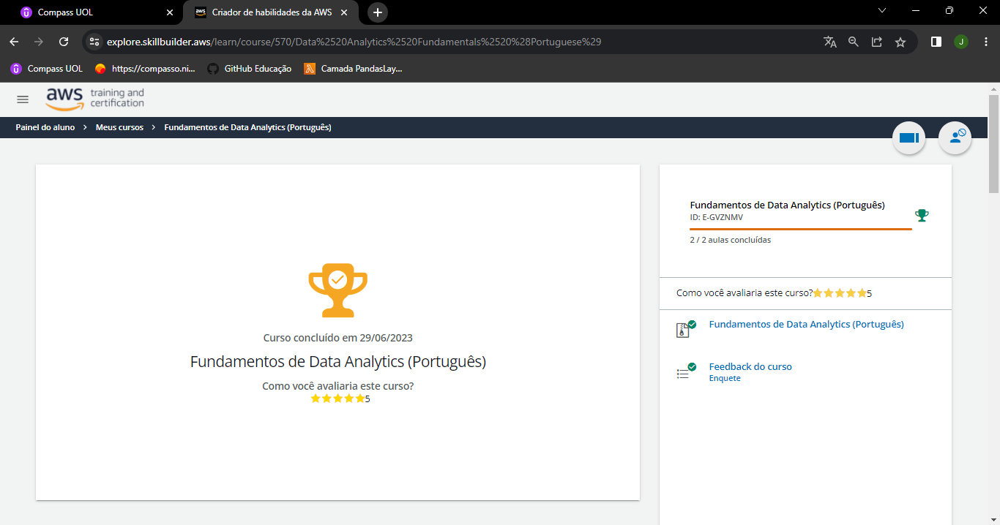

- 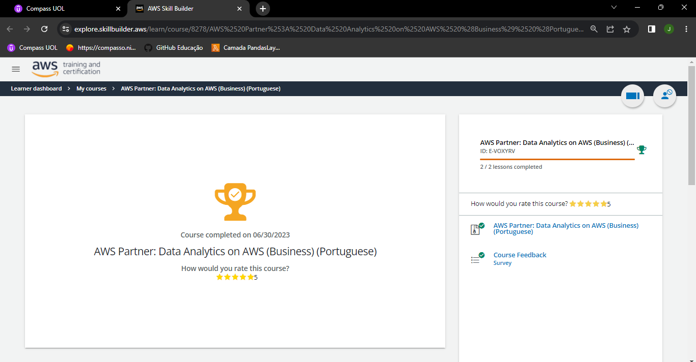

- 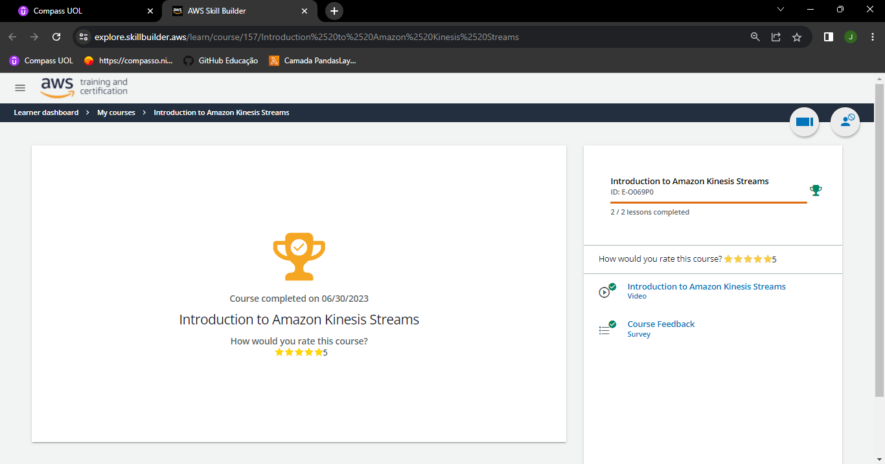

- 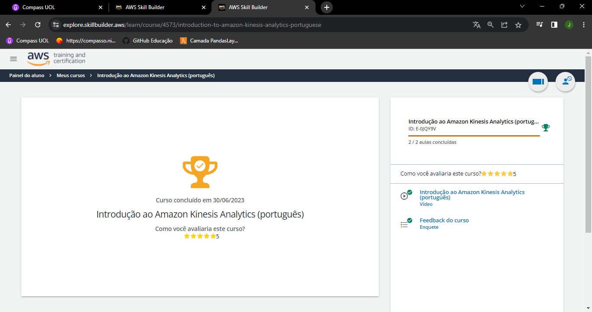

- .png)

- 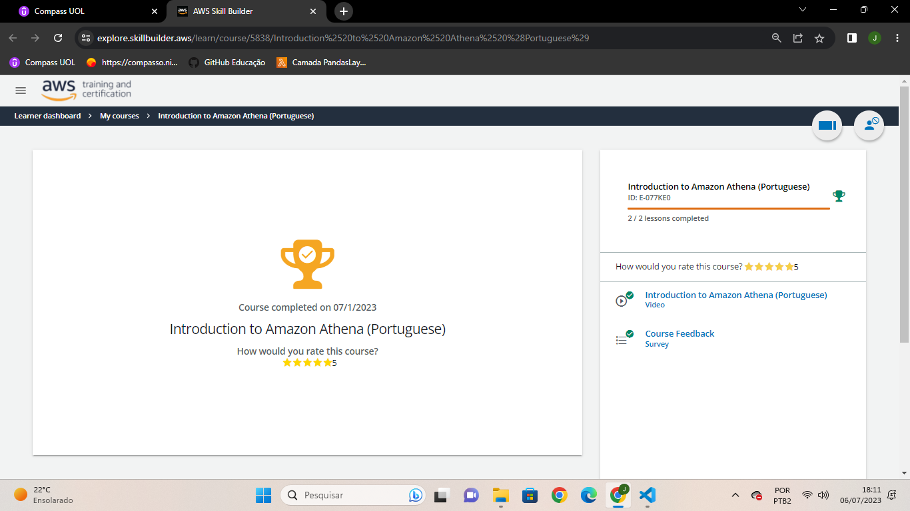

- 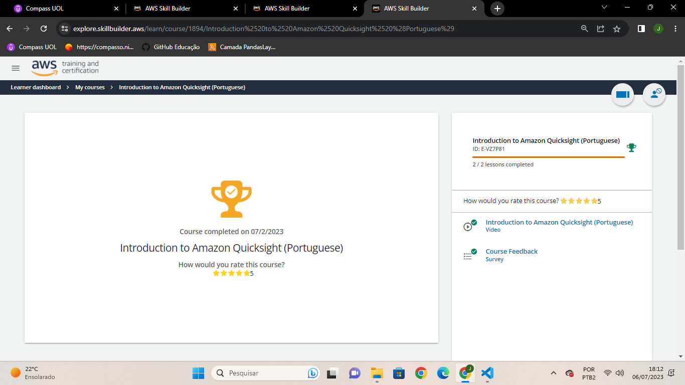

- 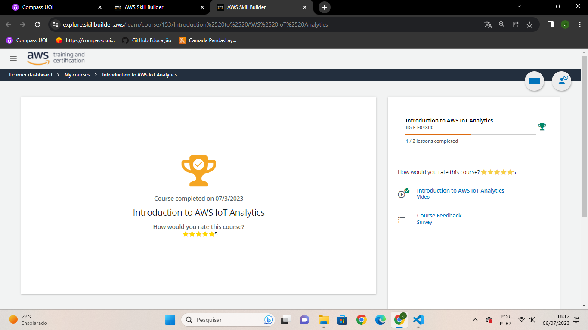

- 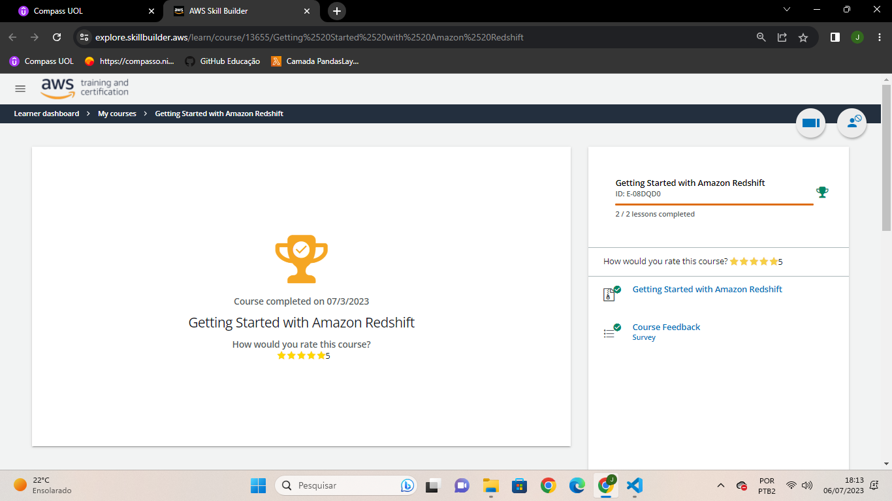

- 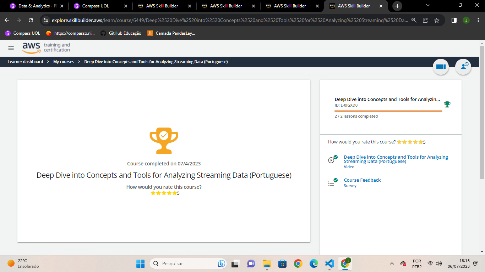

- 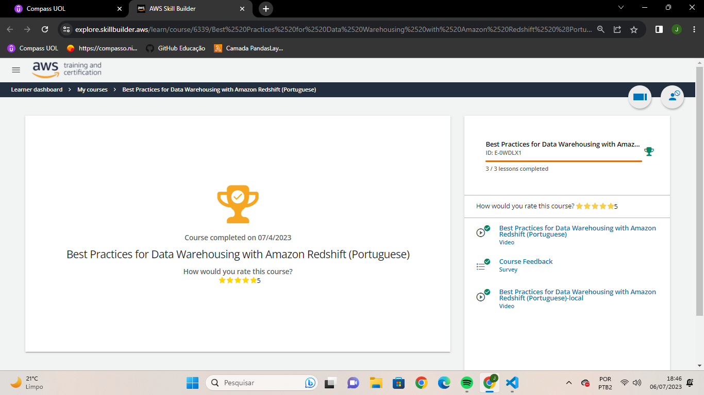

- 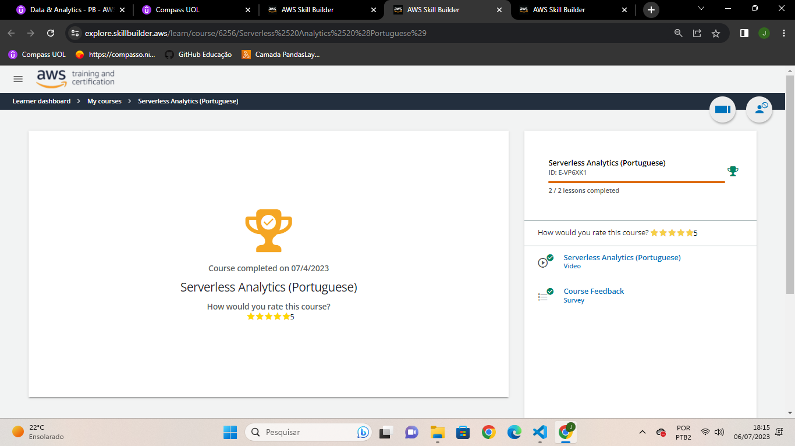

- 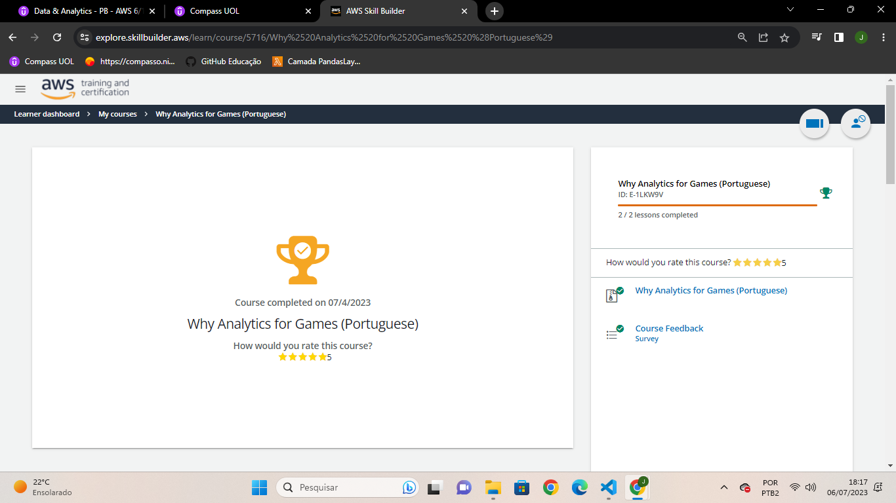