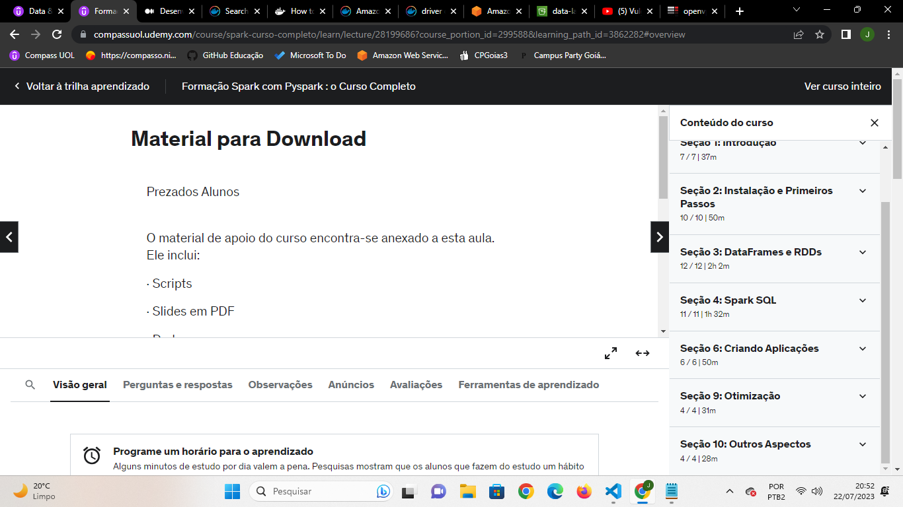

# Exercícios

1. Lab AWS Glue
[Codigos do faca voce mesmo do laboratorio AWS Glue.](exercicios/LaboratorioAWSGlue)

2. Tarefa 1: Python com Pandas e Numpy
[Resposta Ex1.](exercicios/secao3-Exercicios/tarefa1/exerc1.py)
[Resposta Ex2.](exercicios/secao3-Exercicios/tarefa1/exerc3.py)
[Resposta Ex3.](exercicios/secao3-Exercicios/tarefa1/exerc3.py)
[Resposta Ex4.](exercicios/secao3-Exercicios/tarefa1/exerc4.py)

3. Tarefa: Apache Spark - Contador de Palavras
[Comandos utilizados no pyspark para realizar o exercicio do contador de palavras.](exercicios/secao3-Exercicios/tarefa2/comandosUtilizados.py)

# Evidências

[Evidencia 1 - ApacheSpark-ContadordePalavras](evidencias/ApacheSpark-ContadordePalavras/docker.png)

[Evidencia 2 - LAB GLUE](evidencias/labGlue/)

# Certificados

- Certificado do Curso Learn By Example: Hadoop, MapReduce for Big Data problems

- Certificado do Curso Spark com Pyspark
