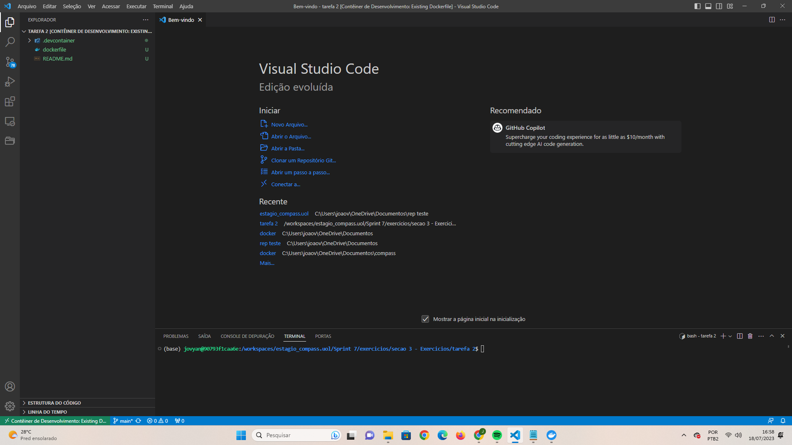

# Exercícios

1. ...
[Codigos do faca voce mesmo do laboratorio AWS Glue.](exercicios/Laboratorio AWSGlue)

2. ...
[Resposta Ex1.](exercicios/exerc1.py)
[Resposta Ex2.](exercicios/exerc3.py)
[Resposta Ex3.](exercicios/exerc3.py)
[Resposta Ex4.](exercicios/exerc4.py)

3. ...
[Resposta Ex1.](exercicios/comandosUtilizandos.py)

# Evidências

# Certificados

- Certificado do Curso Learn By Example: Hadoop, MapReduce for Big Data problems

- Certificado do Curso Spark com Pyspark
