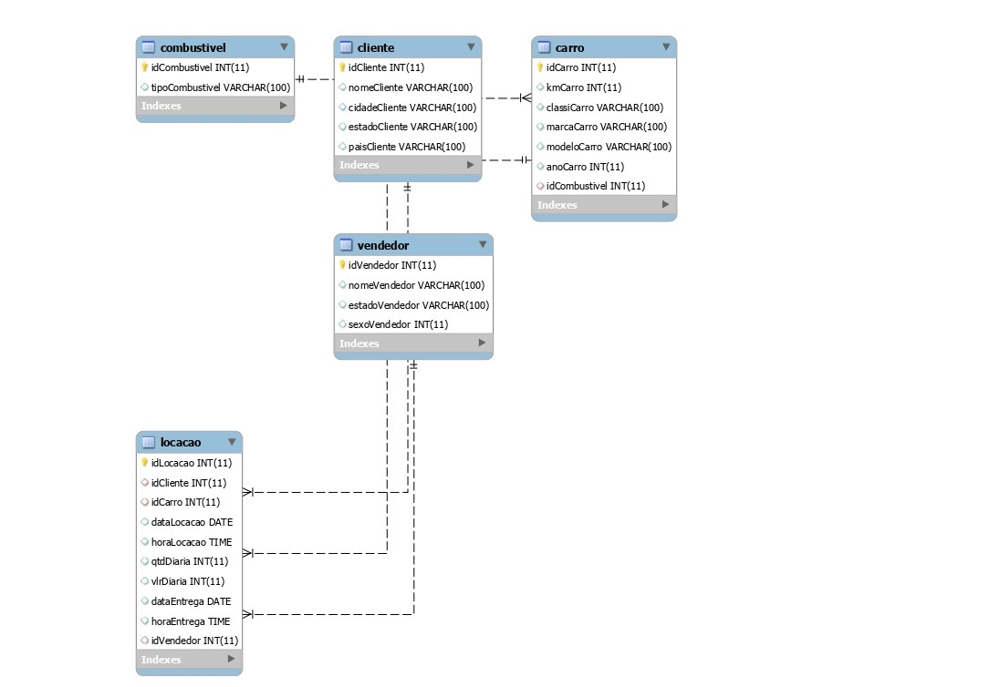

# Normalização de Tabela - Concessionária

Neste projeto, realizaremos a normalização de uma tabela de uma concessionária de veículos. O objetivo é aplicar as formas normais para eliminar redundâncias e garantir que a estrutura do banco de dados seja eficiente e bem organizada.

## Tabela Original

A tabela original possui os seguintes atributos:

- idLocacao (chave primária)
- idCliente (chave estrangeira referenciando a entidade "Cliente")
- nomeCliente
- cidadeCliente
- estadoCliente
- paisCliente
- idCarro (chave estrangeira referenciando a entidade "Carro")
- kmCarro
- classiCarro
- marcaCarro
- modeloCarro
- anoCarro
- idCombustivel (chave estrangeira referenciando a entidade "Combustível")
- tipoCombustivel
- dataLocacao
- horaLocacao
- qtdDiaria
- vlrDiaria
- dataEntrega
- horaEntrega
- idVendedor (chave estrangeira referenciando a entidade "Vendedor")
- nomeVendedor
- estadoVendedor
- sexoVendedor

## Passos da Normalização

1. **Primeira Forma Normal (1NF):**
   - Verificar se cada coluna contém apenas valores atômicos.
   - Garantir que não há valores repetidos.
   - Nenhuma ação necessária, pois a tabela original já está em 1NF.

2. **Segunda Forma Normal (2NF):**
   - Eliminar dependências parciais em relação à chave primária.
   - Nenhuma ação necessária, pois a tabela original já está em 2NF.

3. **Terceira Forma Normal (3NF):**
   - Eliminar dependências transitivas entre atributos não chave.
   - Identificar dependência transitiva entre os atributos "marcaCarro" e "modeloCarro".
   - Separar a entidade "Carro" da entidade "ModeloCarro".

## Nova Estrutura Após Normalização

Entidades resultantes:

1. **Locação:**
   - idLocacao (chave primária)
   - idCliente (chave estrangeira referenciando a entidade "Cliente")
   - idCarro (chave estrangeira referenciando a entidade "Carro")
   - idCombustivel (chave estrangeira referenciando a entidade "Combustível")
   - dataLocacao
   - horaLocacao
   - qtdDiaria
   - vlrDiaria
   - dataEntrega
   - horaEntrega
   - idVendedor (chave estrangeira referenciando a entidade "Vendedor")

2. **Cliente:**
   - idCliente (chave primária)
   - nomeCliente
   - cidadeCliente
   - estadoCliente
   - paisCliente

3. **Carro:**
   - idCarro (chave primária)
   - kmCarro
   - classiCarro
   - idMarcaCarro (chave estrangeira referenciando a entidade "MarcaCarro")
   - anoCarro

4. **Combustível:**
   - idCombustivel (chave primária)
   - tipoCombustivel

5. **Vendedor:**
   - idVendedor (chave primária)
   - nomeVendedor
   - estadoVendedor
   - sexoVendedor

Com a normalização, a tabela foi dividida em entidades independentes, eliminando dependências transitivas e evitando redundâncias. Essa estrutura resultante representa uma organização mais eficiente e coerente para o banco de dados da concessionária.

Esse projeto foi realizado com base na tabela fornecida e seus atributos...

