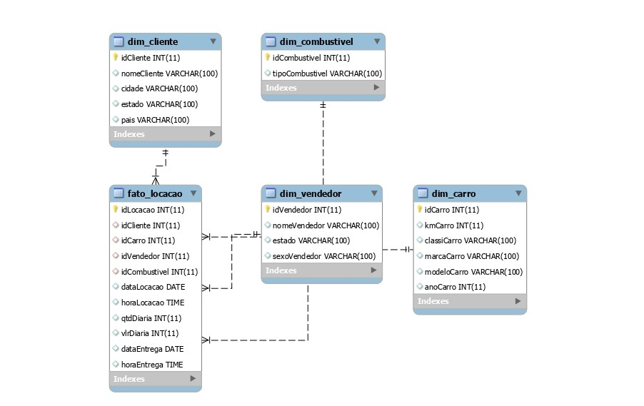

# Modelagem Dimensional das Tabelas

A modelagem dimensional é uma abordagem que visa otimizar a estrutura dos dados para suportar consultas analíticas eficientes. Nesse contexto, foram criadas tabelas dimensionais e uma tabela fato a partir dos dados originais fornecidos. Aqui está um resumo do que foi feito:

## Tabela Fato "FatoLocacao":
- Uma tabela que contém informações sobre as locações de veículos.
- Chaves estrangeiras foram adicionadas para se relacionar com as tabelas dimensionais.

## Tabela DimCliente:
- Uma tabela que contém informações sobre os clientes.
- As colunas de identificação, nome, cidade, estado e país foram incluídas.

## Tabela DimCarro:
- Uma tabela que contém informações sobre os carros disponíveis.
- As colunas de identificação, quilometragem, classificação, marca, modelo e ano foram incluídas.

## Tabela DimVendedor:
- Uma tabela que contém informações sobre os vendedores.
- As colunas de identificação, nome, estado e sexo foram incluídas.

## Tabela DimCombustivel:
- Uma tabela que contém informações sobre os tipos de combustível.
- As colunas de identificação e tipo de combustível foram incluídas.

Aqui está o diagrama da modelagem criada:

