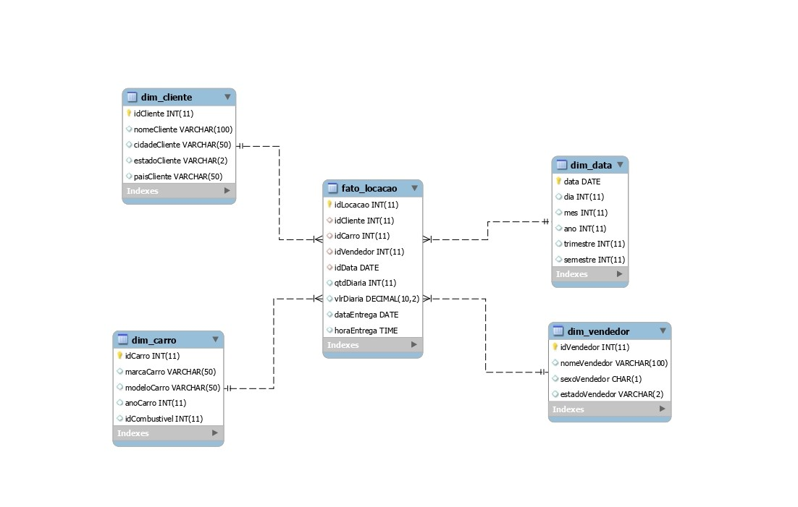

# Modelagem Dimensional das Tabelas

Nesta tarefa 2, realizei a modelagem dimensional de um conjunto de tabelas para otimizar a estrutura de dados visando análises eficientes. Abaixo estão os detalhes das tabelas criadas:

## Tabela Fato "Fato_Locacao":
- Uma tabela que registra informações de locações de veículos.
- Chaves estrangeiras foram adicionadas para se relacionar com as dimensões criadas.

## Tabela Dim_Cliente:
- Uma view foi criada (Dim_Cliente) para armazenar informações dos clientes.
- Incluídas colunas como idCliente, nomeCliente, cidadeCliente, estadoCliente e paisCliente.

## Tabela Dim_Carro:
- Uma view foi criada (Dim_Carro) para conter informações sobre os carros disponíveis.
- Adicionadas colunas como idCarro, kmCarro, classiCarro, marcaCarro, modeloCarro e anoCarro.

## Tabela Dim_Vendedor:
- Criada uma view (Dim_Vendedor) para armazenar dados dos vendedores.
- Incluídas colunas como idVendedor, nomeVendedor, sexoVendedor e estadoVendedor.

## Tabela Dim_Data:
- Foi elaborada uma view (Dim_Data) para representar informações temporais.
- Incluídas colunas como data, dia, mes, ano, trimestre e semestre, derivadas da data de locação.

## Tabela Dim_Combustivel:
- Uma view foi criada (Dim_Combustivel) para registrar tipos de combustível.
- Incluídas colunas como idCombustivel e tipoCombustivel.

## Diagrama de Modelagem
Aqui está o diagrama representando a modelagem criada:

Essa abordagem proporciona consultas analíticas mais eficazes, já que as informações relevantes foram denormalizadas nas dimensões e as métricas estão armazenadas na tabela fato. As views criadas unem os dados apropriados para formar a estrutura desejada, otimizando o acesso aos dados para análises mais aprofundadas.

